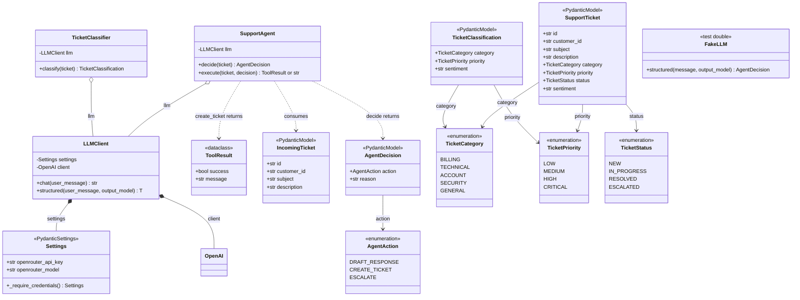
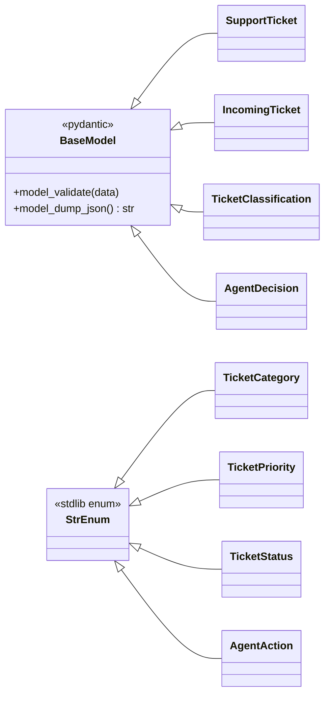

# Class Diagram

Static structure of `support-ops-agent` as it exists at version **0.0.5**.

Companion to [sequence-diagram.md](sequence-diagram.md), which shows runtime ordering.
This document shows types, members, and relationships. Implemented and unimplemented
members are distinguished in the [status table](#module-status).

---

## Full class diagram



`o--` is aggregation: the consumer holds a reference passed in by the caller.
`*--` is composition: the owner creates the part and it cannot exist without it.

---

## Domain layer in detail

All four enums subclass `StrEnum`, so members compare equal to their string values.
That is what lets `response_format` accept `"create_ticket"` from a JSON payload and
bind it to `AgentAction.CREATE_TICKET`.



### Model responsibilities

| Type | Purpose |
| --- | --- |
| `IncomingTicket` | Raw ticket as received, before classification |
| `SupportTicket` | Classified, tracked ticket with lifecycle `status` |
| `TicketClassification` | Output of `TicketClassifier.classify` |
| `AgentDecision` | Output of `SupportAgent.decide`, consumed by `execute` |

`IncomingTicket` and `SupportTicket` share four identical fields (`id`, `customer_id`,
`subject`, `description`) but are **not** related by inheritance. The duplication is
deliberate: incoming tickets are untrusted input parsed before validation, while
`SupportTicket` requires `category` and `priority`. Factoring the shared fields into a
base model would couple the trusted and untrusted shapes, so the overlap is left
explicit. Worth revisiting if a third ticket shape appears.

---

## Test doubles

`FakeLLM` in `tests/agent/fakes.py` deliberately does **not** subclass `LLMClient`:

```python
class FakeLLM:
    def structured(self, message: str, output_model: type):
        return AgentDecision(...)
```

`SupportAgent.__init__` annotates `llm: LLMClient`, so a static type checker will flag
`SupportAgent(FakeLLM())` even though it works at runtime. The coupling is structural,
not nominal. Two consequences:

1. `FakeLLM` must implement every method the agent calls. Renaming `chat` or
   `structured` on `LLMClient` will not fail at import, only when the agent path runs.
2. There is no shared interface or `Protocol` to catch drift at type-check time.

Introducing a `SupportsStructuredLLM` `Protocol` would make the contract explicit and
let the fake satisfy it without a fake base class. Not done here because it is a
design change rather than a documentation fix.

---

## Generics

`LLMClient.structured` is generic:

```python
T = TypeVar("T", bound=BaseModel)

def structured(self, user_message: str, output_model: type[T]) -> T: ...
```

The return type tracks the model passed in, so `structured(prompt, AgentDecision)`
is typed as `AgentDecision` rather than `BaseModel`. This is what allows
`SupportAgent.decide` to declare `-> AgentDecision` without a cast.

---

## Module status

| Module | Types | Status |
| --- | --- | --- |
| `config.py` | `Settings` | Working |
| `llm.py` | `LLMClient` | Working, but `structured` fails against the current default model |
| `main.py` | module function only | Working; does not construct `SupportAgent` or `TicketClassifier` |
| `domain/ticket.py` | 4 enums, 4 models | Working |
| `agent/tools.py` | `ToolResult`, `create_ticket` | Working, stubbed persistence |
| `agent/agent.py` | `SupportAgent.decide` | Implemented, fails live |
| `agent/agent.py` | `SupportAgent.execute` | Working for `CREATE_TICKET`; other actions return placeholder strings |
| `classifier.py` | `TicketClassifier.classify` | Raises `NotImplementedError` |
| `tests/agent/fakes.py` | `FakeLLM` | Test only |

---

## Known gaps

- **`TicketClassifier.classify` is unimplemented.** It calls `llm.chat` and discards
  the result, raising `NotImplementedError`. It should call `llm.structured` with
  `TicketClassification`; until then the class exists only as a type.
- **`SupportAgent.decide` fails against the live API.** The prompt in `agent.py` does
  not state the expected JSON shape, so `poolside/laguna-s-2.1:free` returns Markdown
  prose and `chat.completions.parse` raises `ValidationError`. Adding an explicit
  `Return JSON with exactly these fields` block made the same call succeed. Unit tests
  do not catch this because `FakeLLM` bypasses the transport.
- **`SupportAgent.execute` is partial.** `CREATE_TICKET` calls `create_ticket`;
  `DRAFT_RESPONSE` and `ESCALATE` return placeholder strings, and `create_ticket` does
  not persist anything.
- **No composition root.** `main()` builds only `Settings` and `LLMClient`. The wiring
  in roadmap Phase 3 and 4 does not exist.
- **Unused import.** `domain/ticket.py` imports `pydantic.Field` without using it.