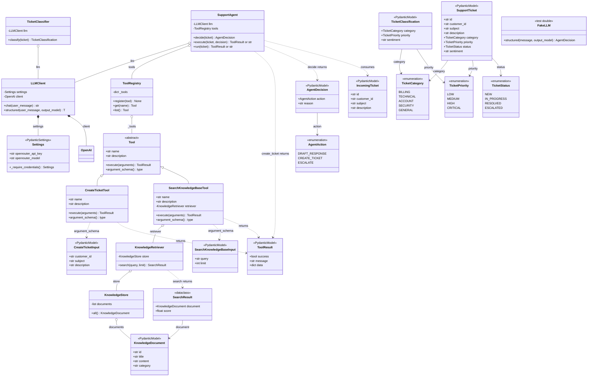
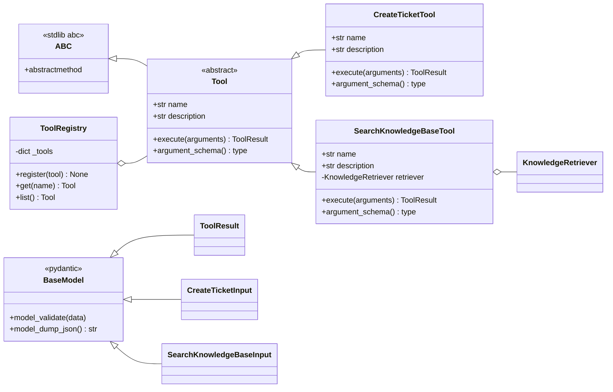
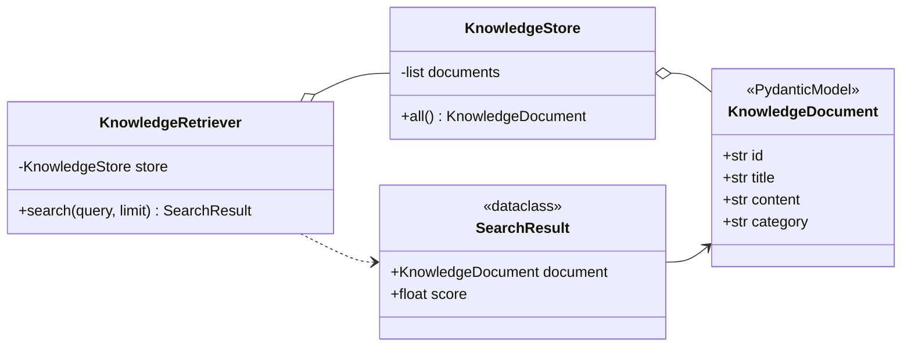
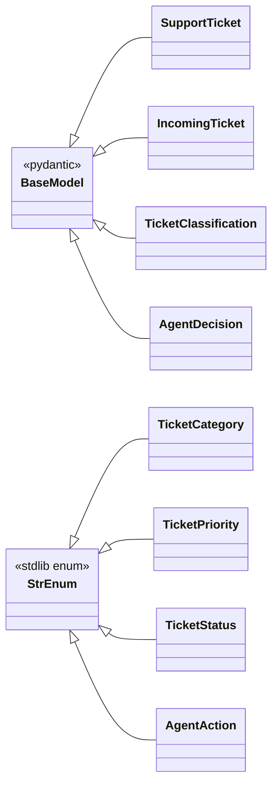

# Class Diagram

Static structure of `support-ops-agent` as it exists at version **0.0.7**.

Companion to [sequence-diagram.md](sequence-diagram.md), which shows runtime ordering.
This document shows types, members, and relationships. Implemented and unimplemented
members are distinguished in the [module status](#module-status).

---

## Full class diagram



`*--` is composition: the owner creates the part. `o--` is aggregation: the consumer
holds a caller-supplied reference. `..>` is a dependency with no stored reference.

`SupportAgent` holds `ToolRegistry` by aggregation rather than composition because the
registry is injected, which is what lets tests substitute tooling.

---

## Registered tools versus reachable tools

`ToolRegistry` holds two tools, but the agent can only reach one of them:

| Registered tool | Reachable via `execute`? | Why |
| --- | --- | --- |
| `create_ticket` | Yes | `AgentAction.CREATE_TICKET` branch |
| `search_knowledge_base` | **No** | no matching `AgentAction`, no dispatch branch |

`AgentAction` has exactly three members — `DRAFT_RESPONSE`, `CREATE_TICKET`, `ESCALATE`
— and `SupportAgent.execute` branches only on `CREATE_TICKET` before handling the two
placeholder actions. There is no `SEARCH_KNOWLEDGE_BASE` action, so the decision schema
offered to the model cannot express "look this up", and `execute` has no branch that
would call `tools.get("search_knowledge_base")`.

The knowledge layer is therefore reachable **only from tests** and from `main`, which
constructs the retriever and passes it into the registry. This is why the suite is green
despite the gap: the agent test asserts on `create_ticket`.

Wiring it requires two coordinated changes, not one:

1. Add `AgentAction.SEARCH_KNOWLEDGE_BASE` so the model can select it.
2. Add an `execute` branch resolving `"search_knowledge_base"` from the registry.

Until then the registry and the action enum are two independent lists that can drift
further apart with no test failing.

---

## Tool layer



Both concrete tools subclass `Tool`. This is enforced, not incidental:
`SearchKnowledgeBaseTool` was originally declared without the base class, which Python
accepted silently because annotations are not checked at runtime. Nothing then guaranteed
`execute` or `argument_schema` existed on a registered tool, and
`ToolRegistry.list() -> list[Tool]` was inaccurate.

### The two-phase tool contract

`SupportAgent.execute` never touches a tool's internals. It asks the tool for its input
schema, builds a validated model from the ticket, then executes:

```python
tool = self.tools.get("create_ticket")
arguments = tool.argument_schema()(
    customer_id=ticket.customer_id,
    subject=ticket.subject,
    description=ticket.description,
)
return tool.execute(arguments)
```

So `argument_schema()` returning `CreateTicketInput` serves double duty: it types the
arguments, and it validates them through pydantic before the tool runs. Missing
required fields fail at the call site rather than inside tool logic.

`SearchKnowledgeBaseInput.limit` additionally carries `ge=1, le=10`, so an
out-of-range limit is rejected by pydantic at the call site.

`ToolRegistry.get` translates `KeyError` into `ValueError` with `from None`, so callers
see one exception type for "unknown tool" and "duplicate tool" regardless of which
dict operation failed.

### `ToolResult` is not a discriminated union

`execute` is declared `-> ToolResult | str`. Only `CREATE_TICKET` returns a
`ToolResult`; `DRAFT_RESPONSE` and `ESCALATE` return bare placeholder strings. Callers
must type-check before touching `.success` or `.data`, which is why `main()` can
legitimately print either a string or a pydantic model. A discriminated union or a
consistent envelope would remove the need for that check.

`ToolResult.data` is typed `dict[str, Any] | None`, and the two tools use it
inconsistently: `create_ticket` returns flat keys (`ticket_id`, `customer_id`), while
`search_knowledge_base` returns a single nested `results` list of dicts. Consumers must
special-case per tool.

---

## Knowledge layer



`KnowledgeStore` is an in-memory list holder with a single `all()` accessor, and
`seed.default_documents()` returns four hard-coded documents covering password reset,
duplicate billing, account lockout, and refund policy.

### Scoring is naive token overlap

`KnowledgeRetriever.search` lowercases the query and each document's
`title + category + content`, splits on whitespace, and scores the size of the
intersection of word *sets*:

```python
overlap = query_words & document_words
score = len(overlap)
```

Consequences worth knowing before relying on it:

- **No stemming or lemmatisation.** "charged" and "charge" are different tokens.
- **No IDF weighting.** A common word contributes as much as a distinctive one, so
  scores are not comparable across queries.
- **Set, not multiset.** A repeated term raises no score.
- **Scores are raw counts cast to `float`**, so `2.0` means "two shared words", not a
  normalised relevance.

Observed behaviour on the seed corpus:

| Query | Results |
| --- | --- |
| `customer charged twice` | KB-002 (2.0) |
| `locked out of my account` | KB-003 (2.0), KB-001 (1.0) |
| `refund policy` | KB-004 (2.0) |

This is lexical matching, not semantic retrieval. A query phrased the way a customer
would actually type it — "can't sign in", "double charged" — will not match
"Account Locked" or "Duplicate Billing Charge". Fine as a placeholder; it will need
stemming, IDF, or embeddings once real content is loaded.

---

## Domain layer

All four enums subclass `StrEnum`, so members compare equal to their string values.
That is what lets `response_format` accept `"create_ticket"` from a JSON payload and
bind it to `AgentAction.CREATE_TICKET`.



| Type | Purpose |
| --- | --- |
| `IncomingTicket` | Raw ticket as received, before classification |
| `SupportTicket` | Classified, tracked ticket with lifecycle `status` |
| `TicketClassification` | Intended output of `TicketClassifier.classify` |
| `AgentDecision` | Output of `SupportAgent.decide`, consumed by `execute` |

`IncomingTicket` and `SupportTicket` share four identical fields (`id`, `customer_id`,
`subject`, `description`) but are **not** related by inheritance. The duplication is
deliberate: incoming tickets are untrusted input parsed before validation, while
`SupportTicket` requires `category` and `priority`. Factoring the shared fields into a
base model would couple the trusted and untrusted shapes. Worth revisiting if a third
ticket shape appears.

---

## Duplicate `ToolResult` types

There are currently **two** distinct classes named `ToolResult`:

| Location | Kind | Fields | Used by |
| --- | --- | --- | --- |
| `tools/base.py` | `pydantic.BaseModel` | `success`, `message`, `data` | `Tool`, `CreateTicketTool`, `SupportAgent` |
| `agent/tools.py` | `@dataclass` | `success`, `message` | nothing |

They are unrelated classes; `tools.base.ToolResult is agent.tools.ToolResult` is
`False`. `agent/tools.py` is **dead code** — nothing in `src/` or `tests/` imports it
after the tool registry refactor. It still exposes a `create_ticket` function, so both
these imports would succeed and return differently-shaped objects:

```python
from support_ops.tools.base import ToolResult  # pydantic, has .data
from support_ops.agent.tools import ToolResult  # dataclass, no .data
```

Deleting `agent/tools.py` would remove the ambiguity. It is kept in this diagram only
to document the duplication.

---

## Test doubles

`FakeLLM` in `tests/agent/fakes.py` deliberately does **not** subclass `LLMClient`:

```python
class FakeLLM:
    def structured(self, message: str, output_model: type):
        return AgentDecision(...)
```

`SupportAgent.__init__` annotates `llm: LLMClient`, so a static type checker flags
`SupportAgent(llm=FakeLLM(), ...)` even though it works at runtime. The coupling is
structural, not nominal. Two consequences:

1. `FakeLLM` must implement every method the agent calls. Renaming `structured` on
   `LLMClient` will not fail at import, only when the agent path runs.
2. There is no shared interface or `Protocol` to catch drift at type-check time.

A `SupportsStructuredLLM` `Protocol` would make the contract explicit. Not done here
because it is a design change rather than a documentation fix.

---

## Generics

`LLMClient.structured` is generic:

```python
T = TypeVar("T", bound=BaseModel)


def structured(self, user_message: str, output_model: type[T]) -> T: ...
```

The return type tracks the model passed in, so `structured(prompt, AgentDecision)` is
typed as `AgentDecision` rather than `BaseModel`. That is what lets `SupportAgent.decide`
declare `-> AgentDecision` with no cast.

---

## Module status

| Module | Types | Status |
| --- | --- | --- |
| `config.py` | `Settings` | Working |
| `llm.py` | `LLMClient` | Working against the current default model |
| `domain/ticket.py` | 4 enums, 4 models | Working |
| `knowledge/document.py` | `KnowledgeDocument` | Working |
| `knowledge/store.py` | `KnowledgeStore` | Working, in-memory only |
| `knowledge/seed.py` | `default_documents` | Working, 4 hard-coded documents |
| `knowledge/retriever.py` | `KnowledgeRetriever`, `SearchResult` | Working, naive scoring |
| `tools/base.py` | `Tool` (ABC), `ToolResult` | Working |
| `tools/create_ticket.py` | `CreateTicketInput`, `CreateTicketTool` | Working, stubbed persistence |
| `tools/search_knowledge_base.py` | `SearchKnowledgeBaseInput`, `SearchKnowledgeBaseTool` | Working, **unreachable from agent** |
| `tools/registry.py` | `ToolRegistry`, `create_default_registry` | Working, now requires a retriever |
| `agent/agent.py` | `decide`, `execute`, `run` | Working; 2 of 3 actions placeholders |
| `main.py` | module function only | Working composition root |
| `agent/tools.py` | `ToolResult`, `create_ticket` | **Dead code**, superseded by `tools/` |
| `classifier.py` | `TicketClassifier.classify` | Raises `NotImplementedError` |
| `tests/agent/fakes.py` | `FakeLLM` | Test only |

---

## Known gaps

- **`search_knowledge_base` is unreachable from the agent.** It is registered, but
  `AgentAction` has no matching member and `execute` has no dispatch branch, so the
  decision schema cannot even express the action. See
  [registered versus reachable](#registered-tools-versus-reachable-tools).
- **`TicketClassifier.classify` is unimplemented.** It calls `llm.chat`, discards the
  result, and raises `NotImplementedError`. It should call `llm.structured` with
  `TicketClassification`, which is the pattern `SupportAgent.decide` already uses.
- **Duplicate `ToolResult`.** See below; `agent/tools.py` should be deleted.
- **`execute` is partial.** `CREATE_TICKET` invokes a real tool; `DRAFT_RESPONSE` and
  `ESCALATE` return placeholder strings, and `CreateTicketTool` fabricates a constant
  ticket id `T-NEW-001` rather than persisting anything.
- **Retriever scoring is naive.** Token-set overlap with no stemming, IDF, or
  normalisation. It matches the seed corpus but not natural customer phrasing.
- **Model choice drives the demo.** `poolside/laguna-s-2.1:free` selected `escalate` for
  every ticket tried, including unambiguous duplicate-billing cases. `main()` therefore
  usually prints a placeholder string rather than exercising tool execution. Test
  `execute` with an explicit `AgentDecision` to exercise dispatch independently of
  model judgement.
- **No tool-exposure to the model.** Tools are never advertised to the LLM; the action
  enum and the tool registry are maintained separately and can drift.
- **Unused import.** `domain/ticket.py` imports `pydantic.Field` without using it.