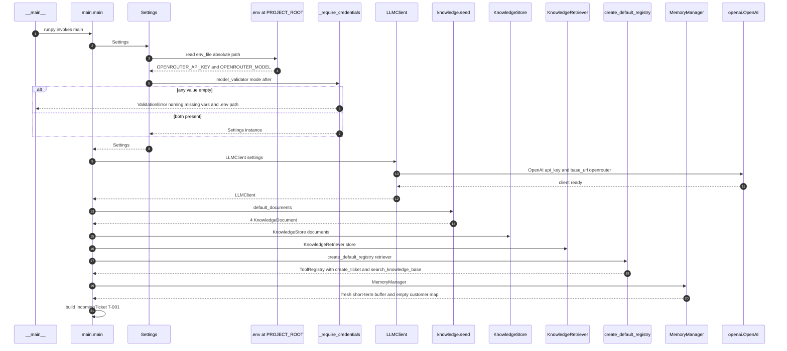
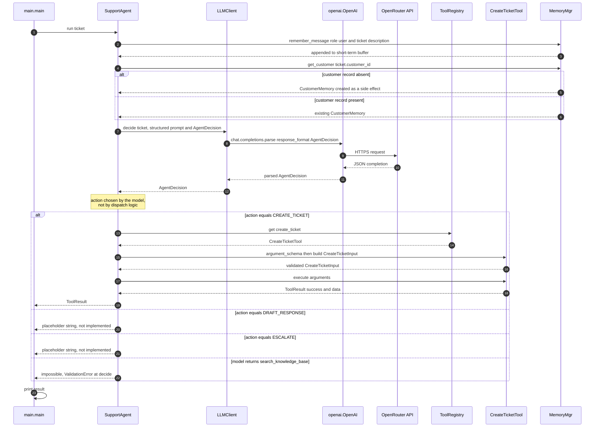
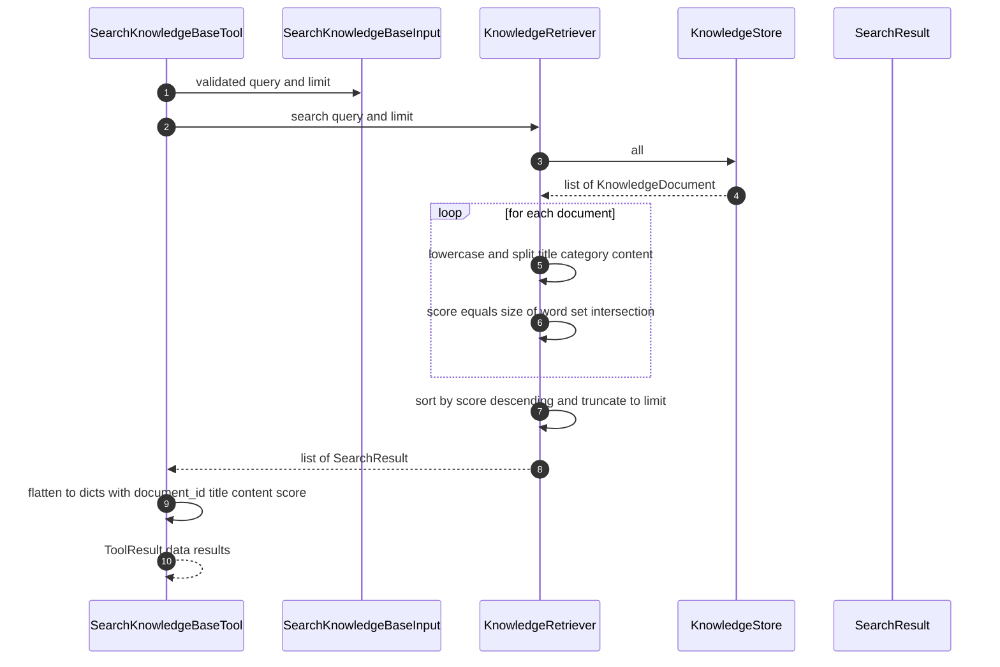
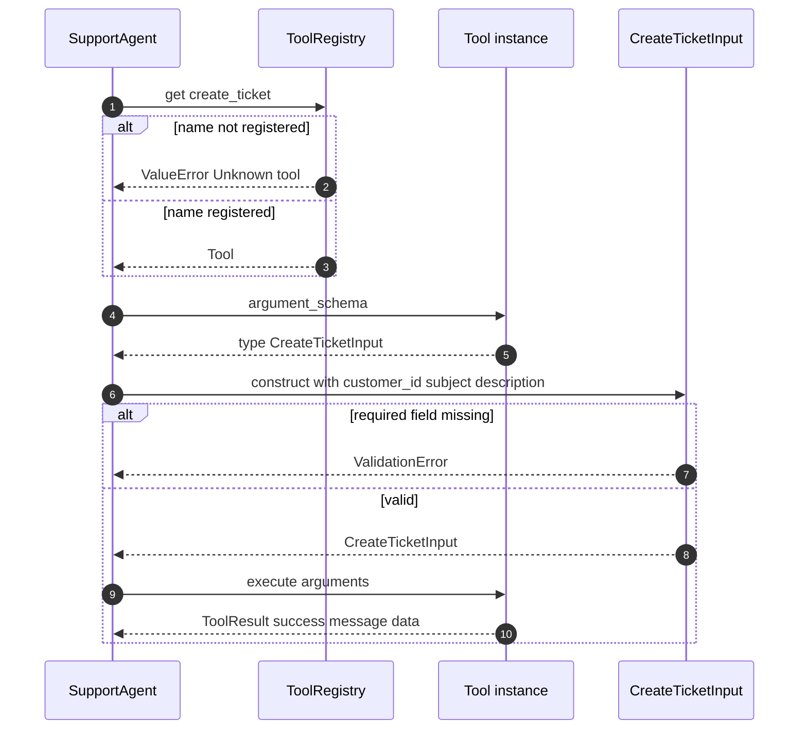
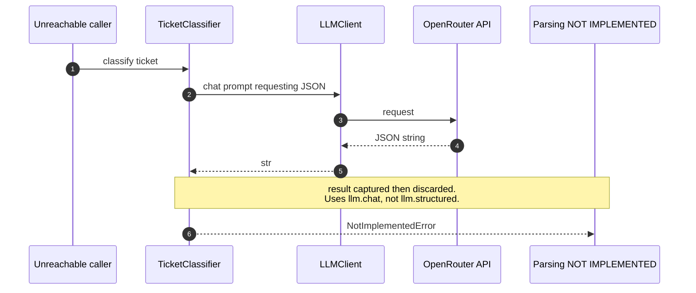
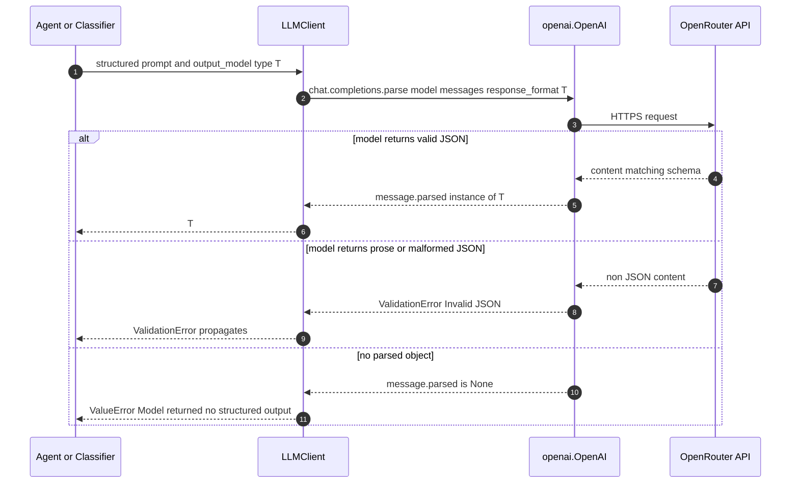

# Sequence Diagrams

Diagrams of the `support-ops-agent` runtime as it exists at version **0.0.9**.

These describe **implemented** behaviour, not the target architecture in
[roadmap.md](roadmap.md). Where a code path raises `NotImplementedError`, that is shown
explicitly rather than drawn as a working step.

Companion to [class-diagram.md](class-diagram.md), which shows types and relationships.

Rendered automatically by GitHub, GitLab, and any Mermaid-capable Markdown viewer.

---

## 1. Startup and configuration resolution

Entry point `support_ops.main.main`. Configuration is resolved from the project root,
**not** the current working directory, so `python -m support_ops.main` behaves the same
from any directory.



Key detail: `PROJECT_ROOT` is computed as `Path(__file__).resolve().parents[2]`, so
`env_file` is absolute. An earlier relative `".env"` silently resolved against the cwd
and produced empty credentials.

`create_default_registry` is a module-level factory, **not** a method on `ToolRegistry`.
When it was nested inside the class body, its `-> ToolRegistry` annotation was evaluated
before the name existed, raising `NameError` at import. It now takes a
`KnowledgeRetriever` because `search_knowledge_base` cannot be constructed without one.

---

## 2. Full agent run (the path `main` takes)

`SupportAgent.run` is `decide` followed by `execute`. This is the complete happy path.



The prompt sent in step 2 must state the JSON shape explicitly. `response_format` alone
does not constrain `poolside/laguna-s-2.1:free`, which otherwise replies with Markdown
prose such as `**Chosen action:** escalate` and causes `ValidationError: Invalid JSON`.
The customer-context sections were added to the prompt without disturbing that contract.

**The `search_knowledge_base` tool is reachable.** `AgentAction` includes
`SEARCH_KNOWLEDGE_BASE`, and `execute_decision` resolves and runs it from the registry.
The model can select knowledge search; results are recorded in `AgentState.tool_calls`
and passed back to the next decision via `build_context`.

---

## 3. Memory-augmented decision

Detail of `SupportAgent.decide`, which both reads and writes memory. This matters
The ticket description is recorded once in `run` (before the loop), so repeated `decide` calls no longer duplicate it.

```mermaid
sequenceDiagram
    autonumber
    participant Agent as SupportAgent
    participant Manager as MemoryManager
    participant Short as ShortTermMemory
    participant Long as LongTermMemory
    participant LLMClient as LLMClient

    Note over Agent,Manager: In 0.0.9 the write happens once in `run`, not in `decide`; see section 2
    Agent->>Manager: get_customer ticket.customer_id
    Manager->>Long: get customer_id
    alt first time this customer is seen
        Long->>Long: insert empty CustomerMemory
        Note over Long: read has a write side effect
    end
    Long-->>Manager: CustomerMemory
    Manager-->>Agent: CustomerMemory
    Agent->>Agent: interpolate facts preferences previous_tickets into prompt
    Agent->>LLMClient: structured prompt and AgentDecision
    LLMClient-->>Agent: AgentDecision
```

Two consequences of doing the write inside `decide`:

1. **Memory is never bounded.** `ShortTermMemory` has no eviction and no maximum length,
   so the buffer grows with recorded messages. Roadmap Phase 6 specifies "Last 5 exchanges".

The customer memory block is serialized with `model_dump_json()` (so it is valid JSON), but other primitive values may be interpolated directly; so the customer block is valid JSON.

```
Customer facts:
{'plan': 'premium'}

Customer preferences:
{'contact': 'email'}

Previous tickets:
['T-000']
```

A newly seen customer renders as `{}` and `[]`, which is indistinguishable from a known
customer that simply has no recorded facts.

---

## 4. Knowledge retrieval

Reachable today only from tests and from `main`, never through the agent. Scoring is
token-set overlap over `title + category + content`.



`limit` is bounded by pydantic at the call site (`ge=1, le=10`), so an out-of-range
value raises before the search runs. Documents scoring zero are dropped entirely, so an
unmatched query returns an empty list rather than low-scoring noise.

Scoring has no stemming, no IDF, and no normalisation: a repeated term cannot raise the
score because sets deduplicate, and `2.0` means literally "two shared words". Matches the
seed corpus, but a customer phrasing like "can't sign in" will not match the
"Account Locked" document.

---

## 5. Tool dispatch detail

The two-phase tool contract inside `execute`. The agent asks the tool for its input
schema, builds a validated model, then executes. It never touches tool internals.



`ToolRegistry.get` converts `KeyError` to `ValueError` with `from None`, so callers see
one exception type for both unknown-tool and duplicate-tool. `register` raises
`ValueError` on a duplicate name, which is why `create_default_registry` can only be
called once per registry.

---

## 6. Unimplemented classifier path

`TicketClassifier.classify` sends a prompt and then **discards** the response, raising
`NotImplementedError`. It is not constructed by `main`, so this path is unreachable in
normal operation.



The prompt here already contains a correct `Return JSON with exactly these fields`
block, so the fix is a one-line change to call
`self.llm.structured(prompt, TicketClassification)` instead of `self.llm.chat(prompt)`.

---

## 7. Structured output contract

`LLMClient.structured` is generic over pydantic models and is the single place where
model output becomes a typed value.



The middle branch is the one that bit this project: the failure surfaced as a pydantic
`ValidationError` from inside the OpenAI SDK, not as an application-level error, so the
fix belonged in the prompt rather than in the transport.

---

## Component reference

| Module | Responsibility | Status |
| --- | --- | --- |
| `config.py` | Resolve settings, validate credentials | Working |
| `llm.py` | OpenRouter transport, plain and structured | Working |
| `main.py` | Composition root, single ticket run | Working |
| `domain/ticket.py` | Enums and pydantic models | Working |
| `knowledge/document.py` | `KnowledgeDocument` schema | Working |
| `knowledge/store.py` | In-memory document list | Working |
| `knowledge/seed.py` | Hard-coded seed corpus | Working |
| `knowledge/retriever.py` | Token-overlap search | Working, naive scoring |
| `tools/base.py` | `Tool` ABC and `ToolResult` | Working |
| `tools/create_ticket.py` | `CreateTicketInput`, `CreateTicketTool` | Working, stubbed persistence |
| `tools/search_knowledge_base.py` | `SearchKnowledgeBaseInput`, `SearchKnowledgeBaseTool` | Working, **reachable** |
| `tools/registry.py` | `ToolRegistry` and default factory | Working |
| `agent/state.py` | `AgentState`, `AgentStatus`, `ToolExecution`, `ToolCall` | Working |
| `agent/agent.py` | `build_context`, `decide`, `execute_decision`, `run` | Working loop-based agent; search_knowledge_base reachable |
| `agent/tools.py` | Legacy `ToolResult`, `create_ticket` | **Dead code**, superseded by `tools/` |
| `memory/models.py` | `ConversationMessage`, `CustomerMemory` | Working |
| `memory/short_term.py` | In-process message buffer | Working, unbounded |
| `memory/long_term.py` | Per-customer facts and tickets | Working, `get` mutates on read |
| `memory/manager.py` | Routes reads and writes to the right store | Working, `get_conversation` untyped |
| `classifier.py` | `classify` LLM parsing | Raises `NotImplementedError` |

---

## See also

- `docs/class-diagram.md` for the static structure, including the memory layer types and
  their behavioural traps.
- `CHANGELOG.md` for what changed in 0.0.9.
- [roadmap.md](roadmap.md) for the target architecture. The memory layer documented here
  is Phase 2, and it is behind the roadmap in three respects: the store is per-process
  rather than SQLite, `ShortTermMemory` is unbounded rather than "Last 5 exchanges", and
  nothing populates long-term facts or previous tickets automatically.