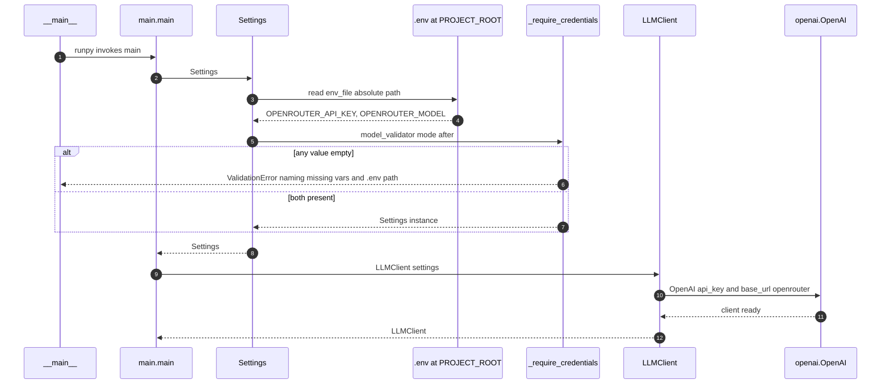
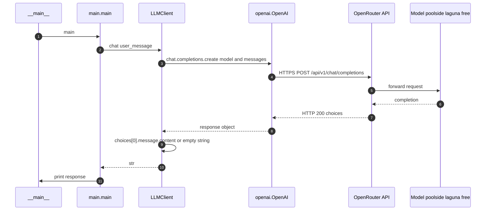
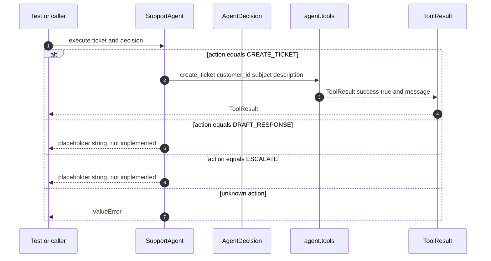
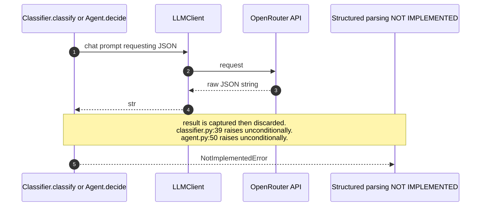
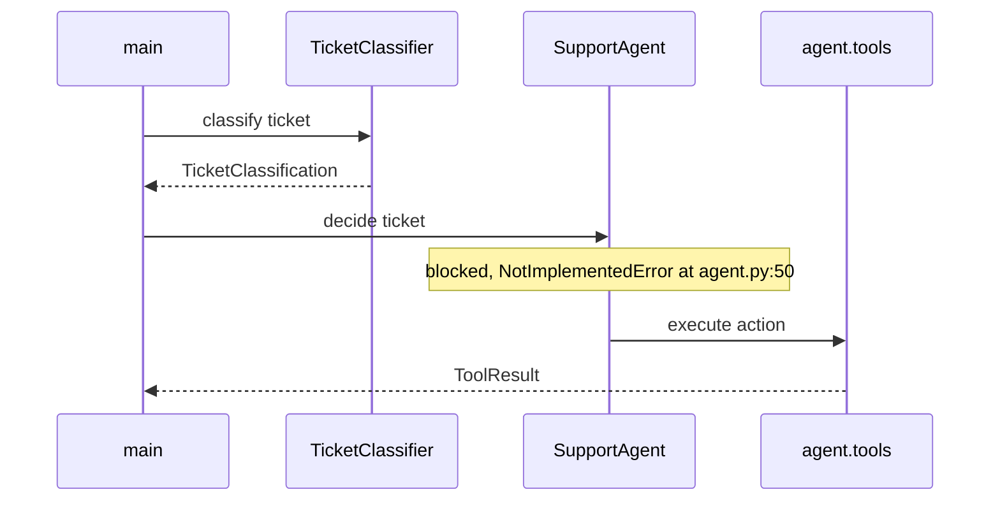

# Sequence Diagrams

Diagrams of the `support-ops-agent` runtime as it exists at version **0.0.3**.

These describe **implemented** behaviour, not the target architecture in
[roadmap.md](roadmap.md). Where a code path raises `NotImplementedError`, that is
shown explicitly rather than drawn as a working step. Two components
(`TicketClassifier`, `SupportAgent`) are not yet constructed by `main()`, so their
diagrams are marked accordingly.

Rendered automatically by GitHub, GitLab, and any Mermaid-capable Markdown viewer.

---

## 1. Startup and configuration resolution

Entry point `support_ops.main.main`. Configuration is resolved from the project root,
**not** the current working directory, so `python -m support_ops.main` behaves the same
from any directory.



Key detail: `PROJECT_ROOT` is computed as `Path(__file__).resolve().parents[2]`, so
`env_file` is absolute. An earlier relative `".env"` silently resolved against the cwd
and produced empty credentials.

---

## 2. Inference path (fully working)

The only end-to-end path that completes today. Invoked by `main()` and exercised by
running the module.



---

## 3. Agent tool dispatch (fully working)

`SupportAgent.execute` dispatches on `AgentDecision.action`. This is the path covered by
`tests/agent/test_agent.py`, which injects a `FakeLLM` and bypasses `decide` entirely.



---

## 4. Unimplemented LLM decision paths

Both `TicketClassifier.classify` and `SupportAgent.decide` send a prompt to the model
and then **discard the response**, raising `NotImplementedError`. Dashed arrows mark the
missing parsing step.



The agent prompt at `agent.py:18-44` already requests the correct shape, and
`AgentDecision` parses it correctly when validated directly:

```
{ "action": "create_ticket", "reason": "..." }
```

So the remaining work is confined to parsing the model string into `AgentDecision` and
`TicketClassification` rather than raising.

---

## Wiring gap

`main()` constructs only `Settings` and `LLMClient`. Neither `TicketClassifier` nor
`SupportAgent` is instantiated anywhere in `src/`, and no module imports them outside
their own tests. The intended composition, per roadmap Phase 3 and 4, is roughly:



This composition does not exist yet and is drawn dashed in intent only — it will not run
until `decide` is implemented.

---

## Component reference

| Module | Responsibility | Status |
| --- | --- | --- |
| `config.py` | Resolve settings, validate credentials | Working |
| `llm.py` | OpenRouter transport via OpenAI SDK | Working |
| `main.py` | Entry point, single-shot chat | Working |
| `agent/tools.py` | `ToolResult`, `create_ticket` stub | Working |
| `agent/agent.py` | `execute` dispatch | Working |
| `agent/agent.py` | `decide` LLM parsing | Raises `NotImplementedError` |
| `classifier.py` | `classify` LLM parsing | Raises `NotImplementedError` |
| `domain/ticket.py` | Enums and pydantic models | Working |